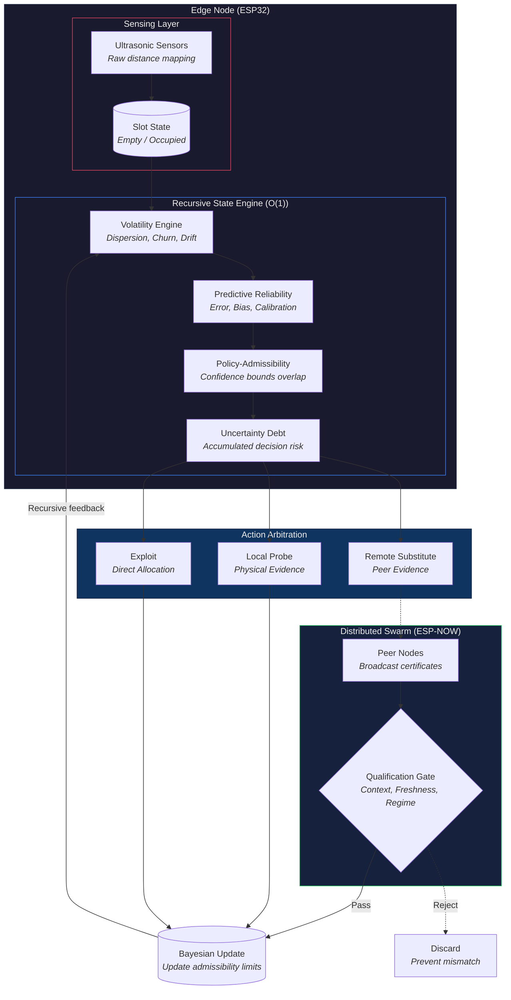

<div align="center">
  <h1>ITAC-K</h1>
  <p><strong>A Bounded-State Distributed Physical Resource-Allocation Controller</strong></p>
  <p>
    <a href="https://github.com/Enternatus/ITAC-K/releases"></a>
    <a href="https://github.com/Enternatus/ITAC-K/actions"></a>
    <a href="configs/final_frozen.json"></a>
    <a href="LICENSE"></a>
  </p>
</div>

<br>
<div align="center">
  
</div>
<br>

## What is ITAC-K?
ITAC-K is a distributed control architecture designed for physical edge nodes (e.g., ESP32 microcontrollers). It manages resource allocation and policy selection under highly uncertain, adversarial, and rapidly changing environmental regimes.

## Architecture

### System Flow Diagram


## Experimental Question & Protocol
**Protocol:** 100-seed unseen adversarial evaluation suite (Seeds 100-199).
*Note: All benchmark results reported below are generated from the Python simulation harness to evaluate algorithmic boundaries. The provided C++ ESP32 code is a proof-of-edge-capability implementation demonstrating that the O(1) state engine maps cleanly to real hardware memory constraints.*

## Final Results
| System | Mean Regret | Physical Probes | Recovery Delay | Peer Mismatch Regret |
| :--- | :--- | :--- | :--- | :--- |
| **ITAC-K (Frozen)** | **15,198.3** | **2,885.1** | **2.7s** | **14,191.8** |
| *Unqualified Remote* | *15,059.7* | *2,639.8* | *0.9s* | *48,500.2 (Cascade Failure)* |
| **LocalOnly** | 19,304.3 | 4,403.2 | 7.4s | 19,966.5 |
| **Generic VoI** | 20,035.6 | 4,500.0 | 8.9s | - |
| **DualControl** | 26,188.0 | 386.7 | 78.8s | 26,252.0 |

**Why Qualification Matters (Adversarial Breakdown):**
While *Unqualified Remote* achieves slightly lower *aggregate* regret across the entire benchmark, it suffers a catastrophic +240% regret explosion (48,500.2 vs 14,191.8) specifically during `Peer Mismatch` scenarios (where a peer occupies a physically contradictory state). The strict Context Equivalence Gate in ITAC-K sacrifices a marginal amount of aggregate regret to entirely prevent this adversarial cascade failure, making it a mandatory safety mechanism rather than an optimization.

## Ablations & Key Findings
*   **Safe Remote Substitution:** Outperformed LocalOnly by strictly filtering poisoned/mismatched swarm data via the equivalence gate.
*   **Boundary-Targeted Probing:** Outperformed the implemented Generic VoI baseline by focusing local probes strictly on overlapping policy confidence intervals.

## Limitations (Failure Envelope)
*   **Synchronized Spoofing:** ITAC-K lacks cryptographic spoofing filters. If malicious peers forge perfectly matching context vectors, poisoned data passes the gate.
*   **Hyper-Volatility Limit:** If the environment transitions faster than the sum of probe execution and propagation delays, uncertainty debt compounds uncontrollably.

## Reproduce the Results
A fresh environment can reproduce the reported simulation benchmark using the pinned dependencies and frozen configuration, subject to normal numerical/platform variation:
```bash
pip install -r requirements.txt
python benchmarks/run_benchmark.py --config configs/final_frozen.json --seeds 100-199
```

## Repository Structure
*   `/src/hardware/` - ESP32 C++ implementations (Proof of edge-capability).
*   `/benchmarks/` - Core Python simulation harness and baselines.
*   `/configs/` - The comprehensive, frozen benchmark parameters.
*   `/reports/` - Detailed ablation studies, architectural complexity bounds, and technical evidence.
*   `/results/final/` - The raw CSV/PNG outputs from the final evaluation.
