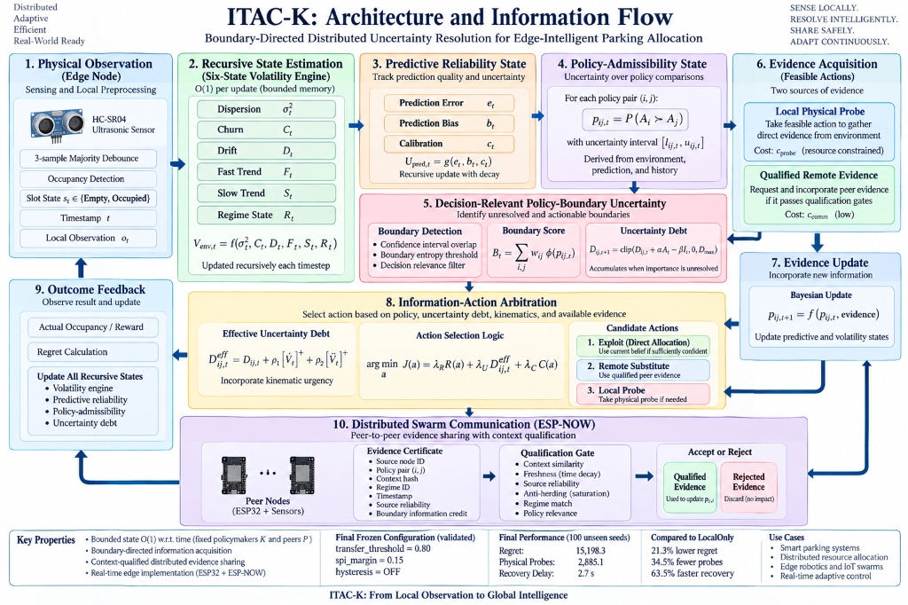

# ITAC-K Architecture

### System Flow Diagram
`mermaid
graph TD
    classDef hardware fill:#f3f4f6,stroke:#6b7280,stroke-width:2px;
    classDef logic fill:#eff6ff,stroke:#3b82f6,stroke-width:2px;
    classDef action fill:#fdf4ff,stroke:#d946ef,stroke-width:2px;
    classDef swarm fill:#f0fdf4,stroke:#22c55e,stroke-width:2px;

    subgraph Physical Edge Node
        S[Ultrasonic Sensors]:::hardware --> |Raw Signal| Pre[Majority Debounce]:::hardware
        Pre --> |t, state| V[Six-State Volatility Engine]:::logic
    end

    subgraph ITAC-K Core Logic
        V --> |V_env, kinematics| P[Predictive Reliability]:::logic
        P --> |e_t, b_t, c_t| A[Policy-Admissibility State]:::logic
        A --> |p_ij, intervals| D[Uncertainty Debt Tracker]:::logic
        D --> |D_eff| Arb{Information Arbitrator}:::logic
    end

    subgraph Action Arbitration
        Arb -->|Confident| E[1. Exploit: Allocate]:::action
        Arb -->|Boundary Overlap| L[2. Local Physical Probe]:::action
        Arb -->|Peer Available| R[3. Remote Substitute]:::action
    end

    subgraph ESP-NOW Swarm
        R -.-> |Context Request| Swarm((Peer Nodes)):::swarm
        Swarm -.-> |Evidence Certificate| Q{Qualification Gate}:::swarm
        Q -->|Pass: Sim > 0.80| Accept[Bayesian Update]:::logic
        Q -->|Fail| Discard[Discard]:::hardware
    end

    L --> Accept
    E --> Accept
    Accept --> |Recursive Feedback| V
`

## Mechanism Status Tracker
*   **Volatility Engine:** ACTIVE + VALIDATED
*   **Policy-Admissibility Relation:** ACTIVE + VALIDATED
*   **Boundary-Targeted Probing:** ACTIVE + VALIDATED
*   **Qualified Remote Evidence:** ACTIVE + VALIDATED
*   **Uncertainty Debt:** ACTIVE + NOT SEPARATELY ABLATED
*   **Kinematic Urgency:** ACTIVE + VALIDATED (Neutral effect in tested shocks)
*   **Anti-Herding (Saturation):** IMPLEMENTED BUT OPTIONAL
*   **Hysteresis:** EVALUATED AND DISABLED (Disabled in Final Champion)

## Mathematical Definitions
*   $\phi(p_{ij,t})$: A distance metric representing the probability of policy boundary intersection.
*   $A_{ij,t}$: The action-cost penalty for probing policy $j$ when $i$ is currently optimal.
*   $I_{ij,t}$: Information gain metric representing the expected variance reduction of the boundary estimator.

## Simulation vs ESP32 Implementation Mapping
| Simulation Component | ESP32 Implementation (sketch_ITAC_Swarm.ino) |
| :--- | :--- |
| Volatility update | `updateVolatility()` |
| Admissibility state | `evalAdmissibility()` |
| Remote certificate | `struct PeerEvidence` |
| Equivalence Gate | `qualifyEvidence()` |
| ESP-NOW transport | `OnDataRecv() / esp_now_send()` |

