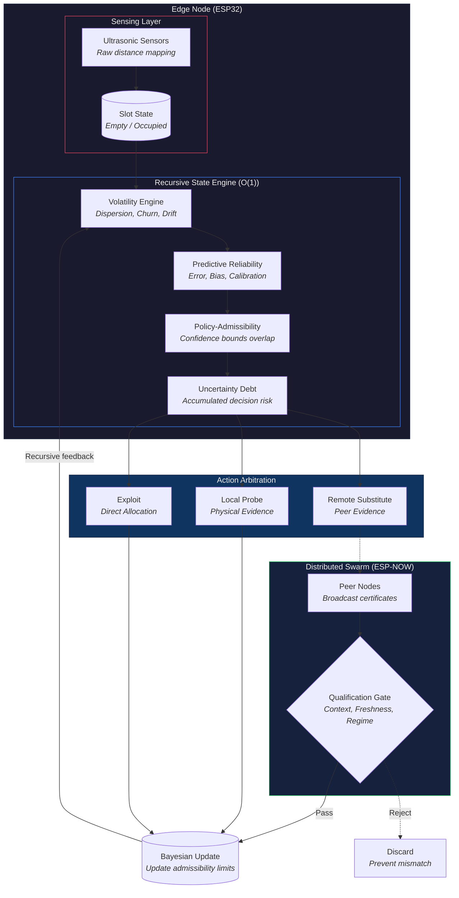

# ITAC-K Architecture

  

### System Flow Diagram

## Mechanism Status Tracker
*   **Volatility Engine:** ACTIVE + VALIDATED
*   **Policy-Admissibility Relation:** ACTIVE + VALIDATED
*   **Boundary-Targeted Probing:** ACTIVE + VALIDATED
*   **Qualified Remote Evidence:** ACTIVE + VALIDATED
*   **Uncertainty Debt:** ACTIVE + NOT SEPARATELY ABLATED
*   **Kinematic Urgency:** ACTIVE + VALIDATED (Neutral effect in tested shocks)
*   **Anti-Herding (Saturation):** IMPLEMENTED BUT OPTIONAL
*   **Hysteresis:** EVALUATED AND DISABLED (Disabled in Final Champion)

## Mathematical Definitions
*   $\phi(p_{ij,t})$: A distance metric representing the probability of policy boundary intersection.
*   $A_{ij,t}$: The action-cost penalty for probing policy $j$ when $i$ is currently optimal.
*   $I_{ij,t}$: Information gain metric representing the expected variance reduction of the boundary estimator.

## Simulation vs ESP32 Implementation Mapping
| Simulation Component | ESP32 Implementation (sketch_ITAC_Swarm.ino) |
| :--- | :--- |
| Volatility update | `updateVolatility()` |
| Admissibility state | `evalAdmissibility()` |
| Remote certificate | `struct PeerEvidence` |
| Equivalence Gate | `qualifyEvidence()` |
| ESP-NOW transport | `OnDataRecv() / esp_now_send()` |
